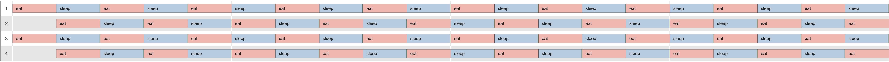

# Philosophers

This project teaches you how to use mutexes and threads in the C programming language using a famous problem called the [philosophers problem](https://en.wikipedia.org/wiki/Dining_philosophers_problem). In short the philosopher problem describes a simulation where *X* amount of philosophers are sitting around a table with *X* amount of forks. In the middle of the table is a bowl of spaghetti from which they all want to eat. The simulation has 3 input parameters. Time it takes for a philosopher to die *A*, time it takes for a philosopher to eat *B* and time a philosopher takes to sleep *C*. When one of the philosophers dies the simulation ends. In this problem the philosopher represents the thread and the fork represents the resource that needs protecting (i.e. with a mutex).

When the simulation starts, each philosopher will want to start eating but there is a constraint. A philosopher needs **2** forks to start eating and they can't share forks. As stated above, there are as many forks as there are philosophers. Your job is to keep the simulation going for as long as possible with the philosophers eating as efficiently as possible.

An example scenario that should run forever would be as follows:
> Lets assume all times are in miliseconds and we have 4 philosophers participating.  
> time_to_die = 410  
> time_to_eat = 200  
> time_to_sleep = 200  

Philosophers cycle through the following states:


## Usage
The program is written in C98 and can be compiled using `gcc`:
```bash
> cd philo
> make
> ./philo <number_of_philos> <time_to_die_ms> <time_to_eat_ms> <time_to_sleep_ms> <OPTIONAL:max_number_of_times_philo_has_to_eat>
> make fclean
```

## Complexity
This project is tough for a couple reasons.

Firstly you have the requirements from 42:
* **Memory leaks.**  
In C you have to deal with memory allocation yourself. No memory leaks are allowed. Heap allocated memory must be freed and no pointers must be lost.
* **Performance.**  
The program must work with max 200 threads.
* **Accuracy**  
The time of death should be reported no more then 10 ms after the philospher actually dies. 

Then you have the problems that come with multithreading:
* **Synchronisation.**  
Having multiple threads do things in a specific order over a longer period of time is hard. Mainly because the CPU decides what thread gets execution cycles at what time and the CPU is responsible for a whole lot of other processes on the PC that you run your program on.
* **Data races.**  
Because you need to keep track of the philosopher its state you'll have to allow for some shared memory. If two threads do a read/write operation on a piece of memory at the same time, you can get undefined behaviour. Data might get corrupted and you're program might not work as you expect it too. To prevent this you can use a mutex. Mutexes allow for a piece of code to only be executed by one thread at a time. They do have their drawbacks, like slowing down the program and causing [deadlocks](https://en.wikipedia.org/wiki/Deadlock).

## Solution
Through multiple iterations of writing this program I've found the following ways to address the points described in the Complexity section.

**Memory leaks.**  
Use as little Heap allocated memory as possible. Only where you really require dynamic memory allocation at runtime should you use `malloc`. In my case this is for creating forks and philosophers since the amount of philosophers is passed through the commandline.

**Performance.**  
The more mutexes, the slower the program becomes. I already need one mutex per fork which with 200 threads means 200 mutexes. Previous iterations also contained mutexes for each individual piece of memory I tried to protect. I've slowly moved to having one global mutex used by all threads instead. I've prefixed variables that need protecting with `__unsafe_` so that it's clear that these variable need a lock around them:
```c
typedef struct s_table
{
    t_fork          *forks;
    int             fork_amount;
    int             __unsafe_saturated_count;
    bool            __unsafe_allowed_to_write;
    bool            __unsafe_someone_died;
    bool            __unsafe_all_saturated;
    pthread_mutex_t lock;
}   t_table;
```

**Accuracy.**  
Time of death needs to be reported no more then 10ms after it happening. The problem is that a philosopher thread will not always be able to report this on time. This is because the `pthread_mutex_lock` are blocking calls (and we're not allowed to use `pthread_mutex_trylock`).

Consider the following scenario:
1. *time_to_die*=350
2. philosopher x tries to pick up a fork at timestamp 300
3. philosopher x gets the fork at timestamp 400 which means the `pthread_mutex_lock` function returns.
4. He will report his dead at timestamp 400 which is way too late.

To solve this an extra thread, next to the philosopher threads, is needed. This "monitoring" thread watches a variable `last_eaten_time` which is set by the philosopher when he's got his hands on two forks and is starting to eat. If the philosopher has not eaten `time_to_die` ms after the start of the simulation or the last time he ate, then the monitoring thread reports the philosopher as dead.

**Synchronisation.**  
To make sure the threads start in a synchronised I've added the following lines to each thread its threading function:
```c
pthread_mutex_lock(&philo->table->lock);
pthread_mutex_unlock(&philo->table->lock);
if (philo->p_number % 2 == 0)
    usleep_checked(philo, (philo->p_options.time_to_eat_ms / 2));
```
The `lock` and `unlock` is to make sure they are synced up when starting. The next two lines have to do with the way I tell philosophers to pick up forks. Each philosopher has a fork left and a fork right of them. Each philosopher also gets a number starting from 1 to n. Based on their number I tell what fork to pick up first, left or right. This way the philosophers can eat in groups. Telling half of the threads to wait for a short bit at the start enforces this behaviour.

Here is a visualation of how this would work with (`./philo 4 410 200 200 10`). You almost don't see them thinking (green), which in this case is good.

<sub>credits to https://nafuka11.github.io/philosophers-visualizer/</sub>
